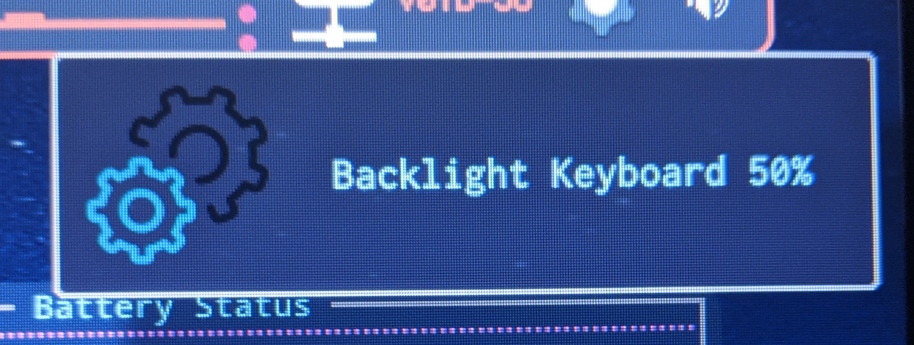

These particular scripts & notifications were designed on and for Ubuntu 20.04 on Openbox Desktop Manager.  I basically wanted a quick script to control my keyboard backlighting, and have that function presented in a notification with a professional level of detail.  The control side of the script is straight forward.  Notifications are pretty easy once installed and just require a little trial and error to get correct.  Choosing your icons is about the most time consuming process if your a perfectionist like me when it comes to uniformity in your desktops visual effects.

If your curious where the directories that give you control of your backlight is:
/sys/class/led/dell::kbd_backlight

Created & Tested onDell 5590 or Dell G5 Gaming 8th Gen
Intel i7-8750H Hexa-Core 4.1ghZ
Nvidia GTX-1060 6GB
16Gb Ram
Samsung 960Pro SSD 2.5" (1TB)
Samsung 960Pro M.2 SSD (500gb)
Intel AX200 Ethernet Card

Requirements

notify-send v.0.7.9 
Gnome Desktop or Openbox (it may work on others not sure)

